# Advanced Lane Finding Project

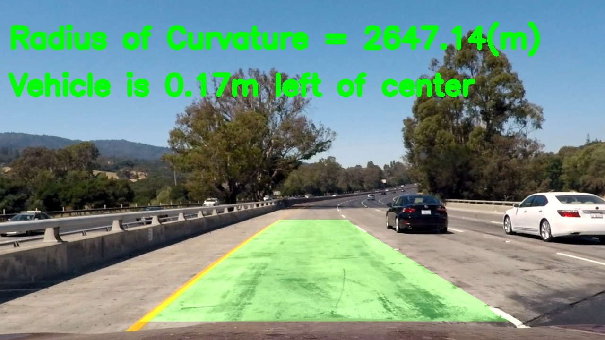

## Overview
This is project 2 from Udacity's Self-Driving Car Engineer Nanodegree program.

The final output of this project is finding a lane on the road, drawing it, and computing vehicle's position with respect to center of the lane, as well as the radius of a lane's curvature.

The steps of this project are the following:
1. Compute the camera calibration matrix and distortion coefficients given a set of chessboard images.
1. Apply a distortion correction to raw images.
1. Apply a perspective transform to rectify an image ("birds-eye view").
1. Use color transforms, gradients, etc., to create a thresholded binary image.
1. Detect lane pixels and fit to find the lane boundary.
1. Determine the curvature of the lane and vehicle position with respect to center.
1. Warp the detected lane boundaries back onto the original image.
1. Output visual display of the lane boundaries and numerical estimation of lane curvature and vehicle position.

## Install Dependencies & Run
1. Install dependencies in your virtual env: `pip install -r requirements.txt`
1. Open up jupyter `jupyter notebook`.
1. Navigae to `advanced-lane-finding.ipynb`.

## Final Video Output
This is the [final video output](./project_video_output.mp4). The road lane is detected well throughout the whole video.

## Detailed Review of Each Step

### Camera Calibration

In this step we compute the camera matrix and distortion coefficients. One efficient way to calibrate a camera is to use chessboard images, where corners in each image will define _image points_, while the chessboard corners grid itself defines _object points_.

For our chessboard grid 9x6, we define object points as
`(0,0,0),(1,0,0),(2,0,0),...(8,5,0)`.

We find chessboard corners on images by using OpenCV function:
```python
patternWasFound, corners = cv2.findChessboardCorners(gray, patternSize, None)
```

Here are found chessboard corners in one example image:
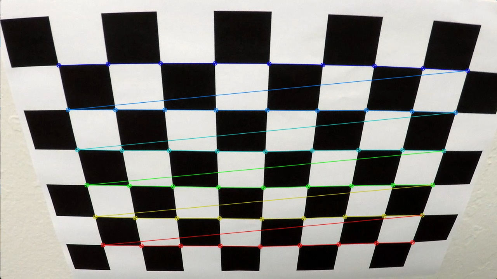

After iterating over all image points for each of our calibration images, we can calculate camera matrix and distortion coefficients, that will be used for image undistortion:
```python
ret, mtx, dist, rvecs, tvecs = cv2.calibrateCamera(objpoints, imgpoints, imgSizeXY, None, None)
```
---
Now here is the result of applying camera matrix and distortion coefficients to undistort one of calibration images:
```python
distortedImg = mpimg.imread('camera_cal/calibration1.jpg')
undist = cv2.undistort(distortedImg, mtx, dist, None, mtx)
```
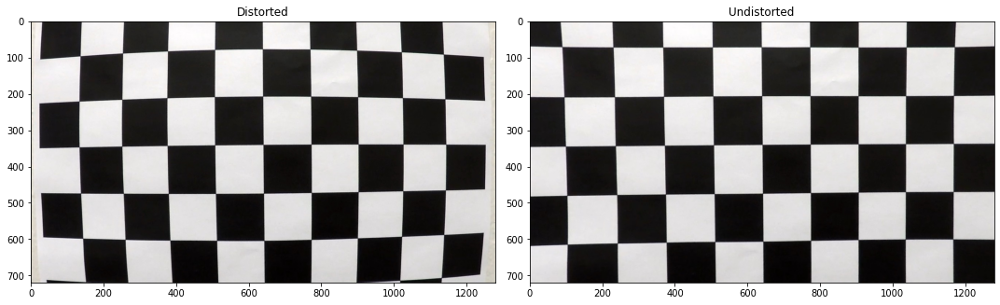


Radial distortion, that is clearly visible on distorted chessboard, disappears in the undistorted image.

### Undistort Test Road Images
We will test our pipeline on a set of test images. These are distorted images:
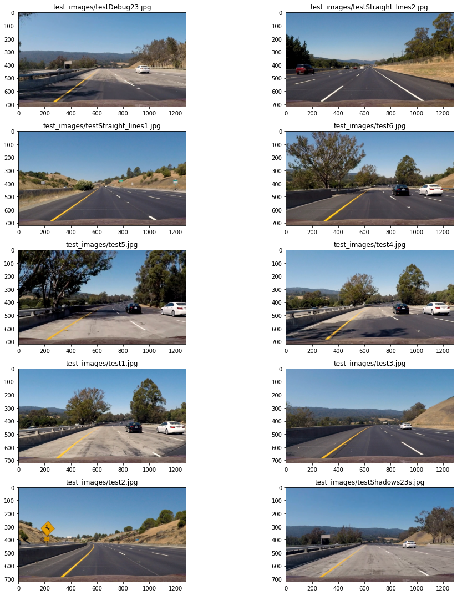


Let's apply undistortion to them, using `cv2.undistort()`, with a
camera matrix and distortion coefficients computed during camera calibration step: 


It can be seen that distortion is removed, if you observe image corners.

### Perspective Transform: Top-Down View

Now we would like to get top-down view of our lane lines, to make them parallel to each other in an image.
To make a perspective transform, we define 4 source points on original image, and map where we would like to get these points in 
a warped image. 

We define source points as trapezoid, and destination points of these lines in a rectangular form. I defined trapezoid manually, by using test road image with straight lines.
```python
def getTrapezoid():
    yBottom = 681
    yTop = 465
    xLeftBottom = 258
    xRightBottom = 1050
    xLeftUp = 575
    xRightUp = 710
    return np.array([[xRightBottom,yBottom],[xLeftBottom,yBottom],[xLeftUp,yTop],[xRightUp,yTop]], np.int32)
```

I will visually verify trapezoid on our test undistorted images:
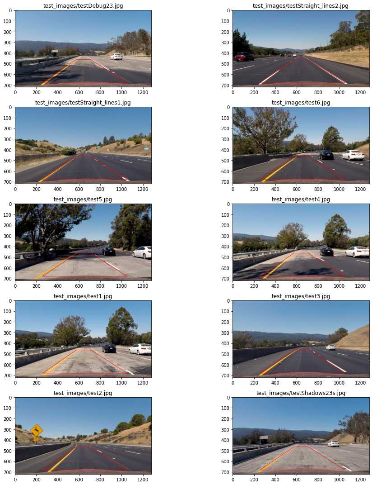

Destination points look like this: 
```python
warpXOffset = 320
dstPerspective = np.float32([(X-warpXOffset, Y), (warpXOffset, Y), (warpXOffset, 0), (X-warpXOffset, 0)])
```

Now that we have src and dst points, we warp image in 2 steps: 
1. We get perspective transform matrix, that is defined by our source and destination points. 
2. We warp perspective using perspective transform matrix.
```python
M = cv2.getPerspectiveTransform(srcPerspective, dstPerspective)
cv2.warpPerspective(img, M, (X, Y), flags=cv2.INTER_LINEAR)
```

We can go back from warped image to original by reversing src and dst points when computing the matrix, and then use `cv2.warpPerspective` with that inverse matrix: 
```python
MInv = cv2.getPerspectiveTransform(dstPerspective, srcPerspective)
```
We will need `MInv` for drawing found lane back on the original image.

This is the result of warping our test undistorted images:
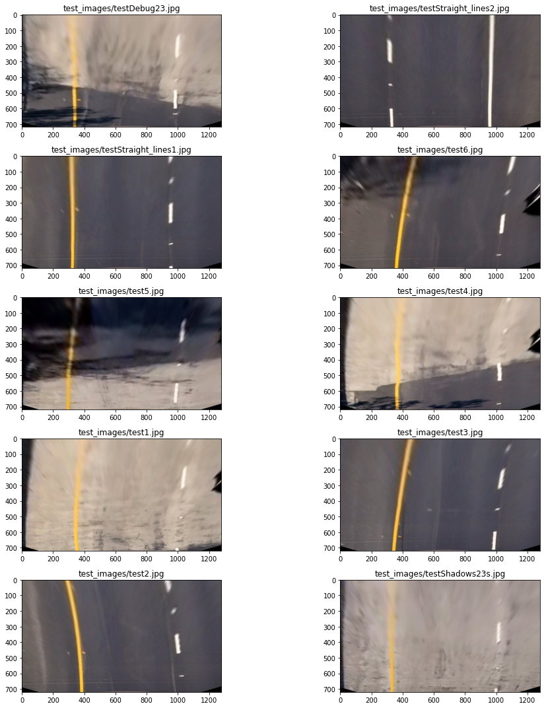

OK, lines look parallel, which is a good sanity check to make sure we didn't mess up our perspective transform.

### Filtering Image to Identify Lane Lines

I played around with 3 methods of filtering lane line pixels from other pixels.
1. Different gradient thresholds: x and y gradients, magnitude and directional gradients.
2. HLS S channel filtering.
3. Simple white mask, to identify white lanes.

I then mapped all three results on an image at the same time, to see how each filtering contributed to the final result:
```python
def combinedFiltering(img, debug=False):
    sChanThresh = hlsSChannelThresh(img)
    combinedGradient = combinedGradientThresh(img)

    gray = cv2.cvtColor(img, cv2.COLOR_RGB2GRAY)
    whiteMask = cv2.inRange(gray, 220, 255) / 255

    # s channel - red; white mask - green; gradient - blue, for debugging
    if debug == True:
        combinedImg = (np.dstack((sChanThresh, whiteMask, combinedGradient)) * 255).astype(np.uint8)
        return np.vstack((img, combinedImg))
    binary = np.zeros_like(sChanThresh).astype(np.uint8)
    binary[(sChanThresh == 1) | (whiteMask == 1)] = 1
    return binary
```

This is the result. \
Red - HLS S channel filtering \
Green - white mask \
Blue - gradients
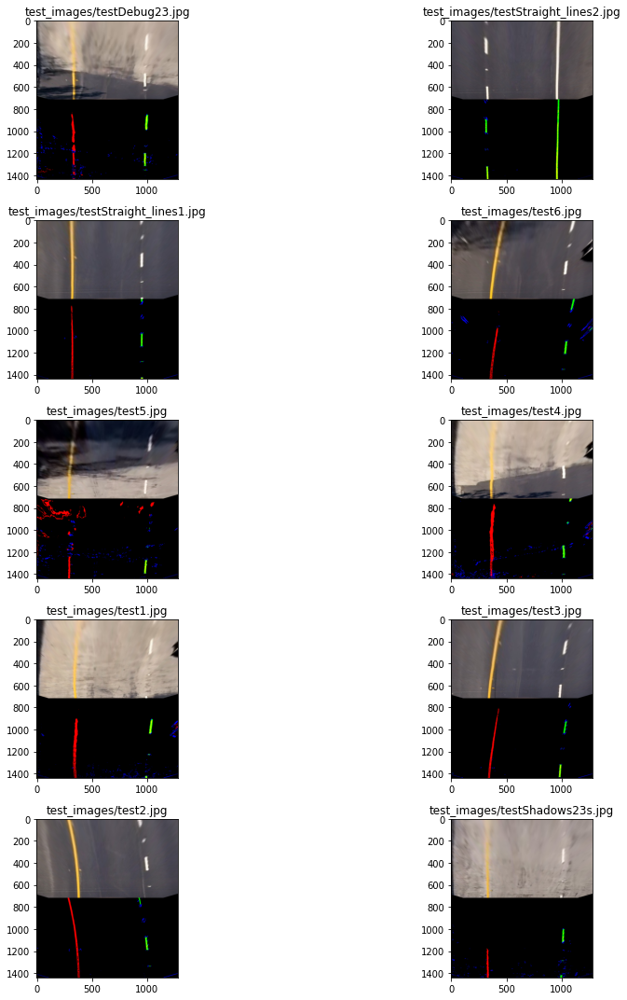

I had other thresholds defined for gradients as well, but I ended up using HLS S channel filtering and white mask, which selected yellow and white lanes quite well. I think given more time and sweat, I could have made gradients work much better.

This is result after combining HLS and white mask filtering into one binary image: 
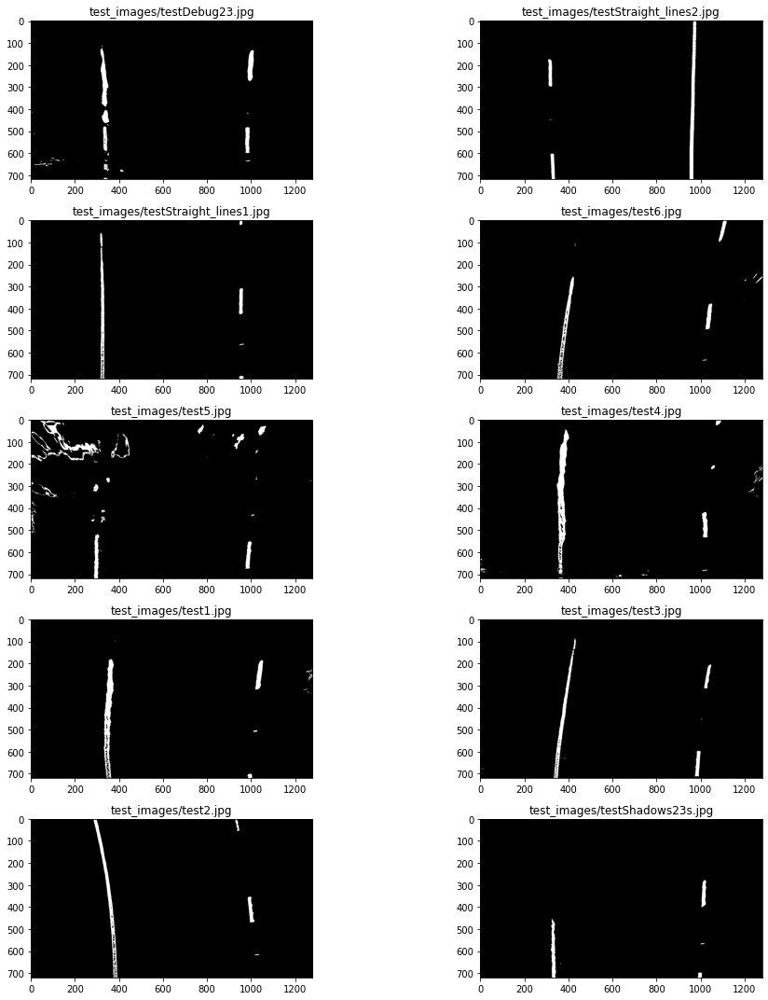

### Identifying Lines on Filtered Image

**Histogram Peaks**

To find start of two lines at the bottom of the image,
we apply histogram peaks. We sum each of image columns (pixel values are now 1 or 0, since it's a binary image), and check at which X values we had maximum peaks, at the left and right part of the image respectively for each fo the line. 

Histogram for one example image looks like this: 
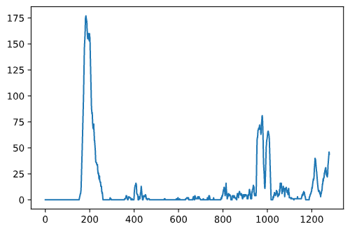

This is how I do it in code:
```python
def hist(img):
    bottomHalf = img[img.shape[0]//2:, :]
    histogram = np.sum(bottomHalf, axis=0)
    return histogram

# ....
histogram = hist(warpedImg)
midpoint = histogram.shape[0]//2
leftBase = np.argmax(histogram[:midpoint])
rightBase = midpoint + np.argmax(histogram[midpoint:])
```

**Sliding Window**

Now we define a rectangle at the bottom for each line. 
We move upwards on the image, considering all pixels that are inside the rectangle as part of the line.

But since our line can be curvy, we need to slide our rectangle if
we notice that line pixels drift left or right. In order to adjust center for the next rectangle, we take the mean of x positions of activated pixels in a current rectangle. 

```python
if len(leftIndices) > minpix:
            currentBaseLeft = np.int(np.mean(nonzerox[leftIndices]))
```

Full code for sliding window algorithm can be found in `findLanePixels` function.

This is the result after applying sliding window:
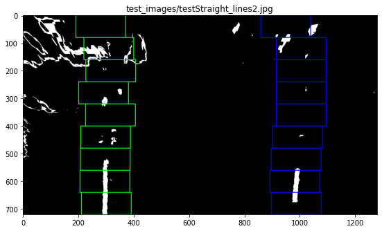

**Polynomial Fit**

Our lines can be fit nicely with 2nd degree polynomial function:
```python
def fitPoly(imgShape, leftx, lefty, rightx, righty):
    # Fit a second order polynomial
    leftFit = np.polyfit(lefty, leftx, 2)
    rightFit = np.polyfit(righty, rightx, 2)
    # Generate x and y values for plotting
    plotY = np.linspace(0, imgShape[0]-1, imgShape[0])
    leftFitX = leftFit[0]*plotY**2 + leftFit[1]*plotY + leftFit[2]
    rightFitX = rightFit[0]*plotY**2 + rightFit[1]*plotY + rightFit[2]
    return leftFitX, rightFitX, plotY, leftFit, rightFit
```

Here are visualized fit polynomials for 2 lines:
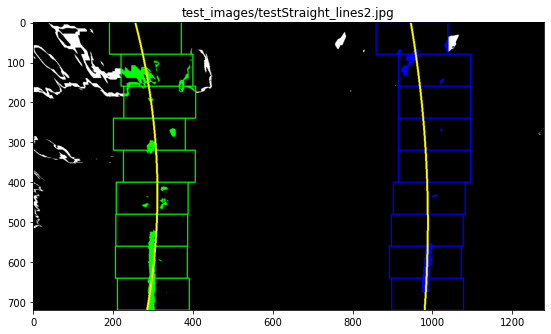

**Search from Prior**

Once we find a good polynomial fit on a first frame, we can search
around that line +- `margin`, rather than applying a sliding window algo again.


```python
def searchAroundPoly(warpedImg, leftFit, rightFit):
    # ....
    leftLaneIndices = ((nonzerox >= leftFit[0]*nonzeroy**2 + leftFit[1]*nonzeroy + leftFit[2] - margin) & 
                      (nonzerox <= leftFit[0]*nonzeroy**2 + leftFit[1]*nonzeroy + leftFit[2] + margin)).nonzero()[0]
    rightLaneIndices = ((nonzerox >= rightFit[0]*nonzeroy**2 + rightFit[1]*nonzeroy + rightFit[2] - margin) & 
                       (nonzerox <= rightFit[0]*nonzeroy**2 + rightFit[1]*nonzeroy + rightFit[2] + margin)).nonzero()[0]
```

### Draw Lane

To draw lane, we need to draw a lane with two polynomials serving as boundaries,
and then unwarp that drawing unto original image.

To unwarp an image, we use previously calculated `Minv` that we got afer applying `cv2.getPerspectiveTransform()` with src and dst points swapped.

```python
def drawLane(undistImage, binaryWarped, Minv, leftFitX, rightFitX, plotY):
    # ....
    newWarp = cv2.warpPerspective(colorWarp, Minv, (xSize, ySize))
    result = cv2.addWeighted(undistImage, 1, newWarp, 0.3, 0)
```

This is what we get:
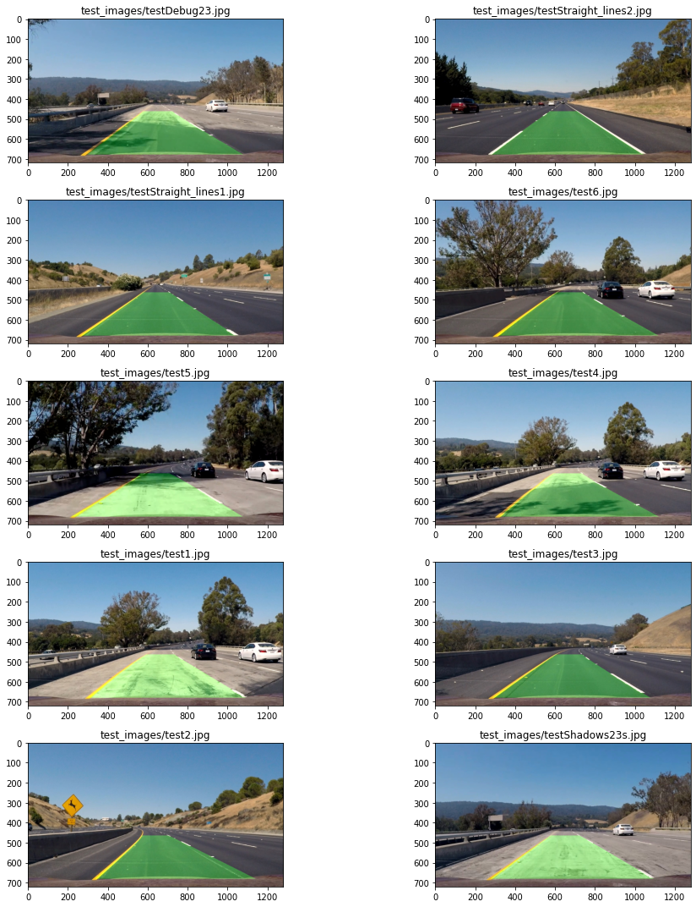

Lanes are identified well on all our test images, even on those that have shadows.

### Radius of a Curvature

We measure radius in meters of a curvature by applying 2 steps: 
* Fitting polynomial again, but this time with X and Y being converted from pixel to meters. 
* Using formula to compute curvature radius, using polynomial coefficients. 

```python
    def measureCurvatureRadiusAndLineBasePos(self, imgShape):
        fit_cr = np.polyfit(self.ploty*ym_per_pix, self.bestx*xm_per_pix, 2)
        yMax = np.max(self.ploty)
        self.radius_of_curvature = ((1 + (2*fit_cr[0]*yMax*ym_per_pix+fit_cr[1])**2)**(3/2)) / abs(2*fit_cr[0])

        self.xLanePosPix = self.best_fit[0]*yMax**2 + self.best_fit[1]*yMax + self.best_fit[2]
```

### Vehicle Position with respect to Lane Center

We compute vehicle position with respet to lane center in this way: 
1. Compute X positions of start of two lines, take their mean.
2. Subtract X midpoint of the image from lane center, convert to meters.

```python
def calculateVehicleCenterOffset(self):
        laneCenter = (self.leftLine.xLanePosPix + self.rightLine.xLanePosPix) / 2
        midX = self.imgShape[1] / 2
        self.vehicleCenterOffset = (laneCenter - midX) * xm_per_pix
```

Radius and vehicle position is displayed on the final image:
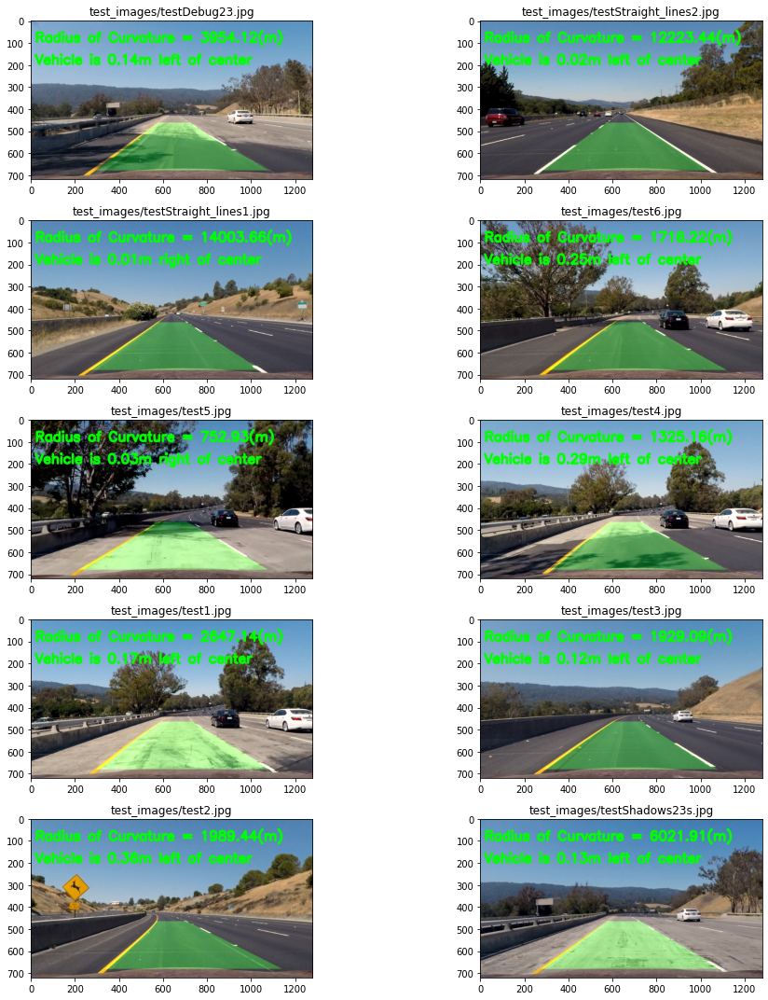

### Video Processing

**Smoothing Line Fits**

In order to avoid jitter when we draw lanes, I apply smoothing over last 20 frames:
```python
self.recent_xfitted = self.recent_xfitted[-20:]
self.bestx = np.mean(self.recent_xfitted, axis=0)
self.best_fit = np.polyfit(plotY, self.bestx, 2)
```

**Outliers Detection**

I checked polynomial coefficients on test images, and I ended up with some
thresholds to decide if next polynomial fit is similar to a previous one.
First, I get the abs difference of coefficients, and then see if it's within a threshold.
```python
# check if detected line is OK or not
        if (self.diffs[0] <= 0.0003 and \
                self.diffs[1] <= 0.1 and \
                self.diffs[2] <= 150) or not self.detected:
            self.current_fit = fit
            self.recent_xfitted.append(fitX)
            self.recent_xfitted = self.recent_xfitted[-20:]
            self.bestx = np.mean(self.recent_xfitted, axis=0)
            self.best_fit = np.polyfit(plotY, self.bestx, 2)
            self.measureCurvatureRadiusAndLineBasePos(imgShape)
            self.detected = True
        else:
            self.detected = False
```

Also to decide if search from prior fit should be used or starting from scratch by using sliding window, I check horizontal distance between two lines: 
```python
# ....
distLinesLow = 2.5
distLinesHigh = 3.9
if self.leftLine.detected and distBetweenLinesMeters >= distLinesLow and distBetweenLinesMeters <= distLinesHigh:
    leftLinePriorSearch = True;
# ....
```

## Issues with Current Pipeline, Potential Improvements

**White Mask Issue**

* One issue is that I use white mask for getting white lines. The pipeline will struggle on frames with intense lighting, since many light pixels would be considered "white", thus generating noise.
* Also, the pipeline would suffer on limited lighting conditions, since white mask wouldn't pick out white line so well, because pixel value would be out of "white" threshold.

**Improving Gradients Filtering**

I definitely could improve filtering using gradients. One approach is to do gradient filtering before apply perspective transform. Lines on original image have tilted angle (trapezoid form), which can be nicely picked up by directional gradient. I tried that, but in my final video I still picked up lots of "shadows noise".

This is the result I got after experimenting with gradient thresholds on original (unwarped) image:
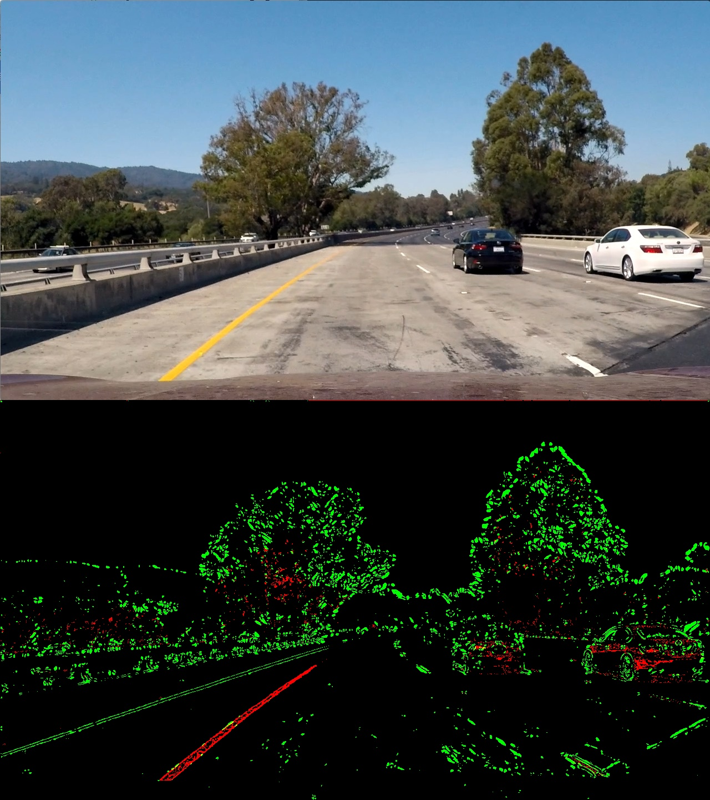
Gradient filtering is GREEN. HLS S channel filtering is RED.

I guess I could improve on thresholds constants and experiment more.


**Trying Different Color Spaces**
* I heard LAB color space picks out yellow color well. I could experiment with that in the future.
* I could try HSV color space as well.

**Improving Line Outlier Detection**

I guess I only scratched the surface with line outlier detection. I used couple of test images to get intuition on coefficients.
* I could improve coefficients thresholds by analyzing more frames.
* Radius curvature change threshold can be implemented to detect ourliers as well.

